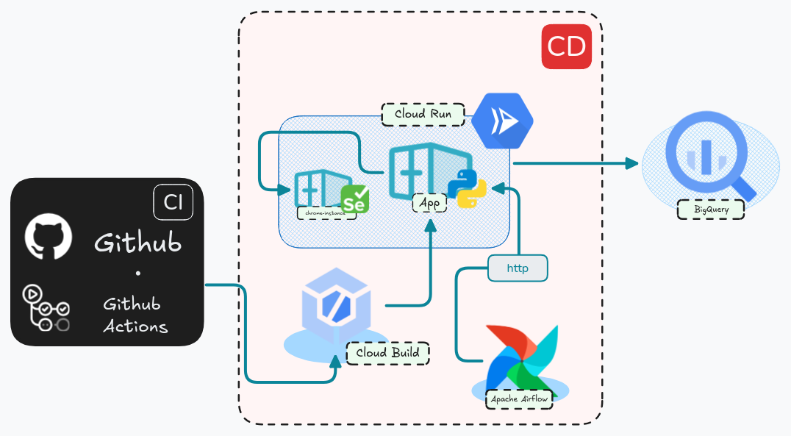

# Financial Data Scrapper

Este projeto automatiza a extração, transformação e carga (ETL) de dados financeiros de fontes web utilizando **Selenium remoto** (Cloud Run), **Apache Airflow** e APIs Python modernas. O objetivo é coletar, processar e armazenar dados financeiros de forma escalável e segura, integrando com Google Cloud Platform.
---
# Arquitetura


---

## 🚀 Principais Funcionalidades

- **Extração de dados financeiros** de sites como Bloomberg usando Selenium remoto.
- **Orquestração de ETL** com Apache Airflow (DAGs customizadas).
- **Deploy automatizado** no Google Cloud Run via Cloud Build.
- **Provisionamento de infraestrutura com Terraform** (Cloud Build, Cloud Run, APIs, IAM, etc).
- **Autenticação segura** entre serviços usando Identity Token do Google.
- **Configuração de conexões Airflow** via YAML para fácil integração.

---

## 🧩 Como funciona

1. **Airflow DAG** dispara uma chamada HTTP para a API no Cloud Run.
2. **API FastAPI** executa o pipeline ETL, que:
   - Usa Selenium remoto (Cloud Run) para raspar dados.
   - Transforma os dados em DataFrames (Polars).
   - Carrega os dados em BigQuery (ou outro destino).
3. **Selenium remoto** é autenticado via Identity Token (dinâmico no Cloud Run, variável local para testes).
4. **Deploy automático**: Push no GitHub aciona o Cloud Build, que faz build, push e deploy no Cloud Run.
5. **Infraestrutura gerenciada via Terraform**: Cloud Build triggers, Cloud Run, APIs, IAM, BigQuery, etc.

---

## ⚙️ Como rodar localmente

1. **Clone o repositório**
2. **Configure o `.env`** com:
   ```
   SELENIUM_URL=https://<seu-endpoint-selenium>/wd/hub
   IDENTITY_TOKEN=<token_gerado_pelo_gcloud>
   GOOGLE_APPLICATION_CREDENTIALS=/caminho/para/sua/key.json
   ```
3. **Instale as dependências**
   ```bash
   pip install -r requirements.txt
   ```
4. **Rode a API**
   ```bash
   uvicorn api.main:app --host 0.0.0.0 --port 8080
   ```
5. **(Opcional) Rode o Airflow localmente**
   ```bash
   astro dev start
   ```

---

## 🧱 Provisionamento de Infraestrutura com Terraform

> ℹ️ **Informação:**  
> A infraestrutura provisionada via Terraform **ainda está em processo de estruturação**. Algumas configurações, integrações ou recursos podem sofrer ajustes e melhorias nas próximas versões do projeto.

1. **Configure as variáveis em `terraform/variables.tf`** (exemplo):
   ```
   project_id         = "seu-projeto-gcp"
   region             = "us-central1"
   github_owner       = "seu-usuario-ou-org"
   github_repo        = "financial_data_scrapper"
   github_full_repo   = "https://github.com/seu-usuario-ou-org/financial_data_scrapper"
   github_app_installation_id = "SEU_ID"
   secret             = "projects/SEU_PROJECT/secrets/SEU_SECRET/versions/latest"
   trigger_name       = "test-trigger"
   selenium           = "https://<seu-endpoint-selenium>/wd/hub"
   service_account    = "projects/-/serviceAccounts/NUMERO_DO_PROJETO@cloudbuild.gserviceaccount.com"
   ```

2. **Inicialize o Terraform**
   ```bash
   cd terraform
   terraform init
   ```

3. **Aplique a infraestrutura**
   ```bash
   terraform apply
   ```
   Isso irá:
   - Ativar as APIs necessárias no GCP.
   - Criar conexões e repositórios do Cloud Build.
   - Criar triggers automatizados para build/deploy.
   - Configurar permissões e service accounts.

4. **Dispare builds manualmente (opcional)**
   ```bash
   gcloud builds triggers run test-trigger --branch=main
   ```

---

## ☁️ Deploy automático no Cloud Run

- O arquivo [`selenium-trigger.cloudbuild.yaml`](selenium-trigger.cloudbuild.yaml) define o pipeline de build e deploy.
- O deploy é feito automaticamente a cada push via Cloud Build Trigger.
- O serviço usa uma Service Account com permissões para gerar Identity Tokens.

---

## 📝 Principais arquivos

- `api/main.py` — Entrypoint da API FastAPI.
- `api/utils/selenium_helper.py` — Helper para scraping com Selenium remoto.
- `api/utils/selenium_remote_connection_v2.py` — Conexão autenticada com Selenium remoto.
- `dags/financial_data_scraper/dag_financial_scraper.py` — DAG do Airflow para orquestração.
- `dockerfile.api` — Dockerfile para build da API.
- `selenium-trigger.cloudbuild.yaml` — Pipeline de CI/CD para Cloud Run.
- `include/airflow_connections.yaml` — Conexões automáticas do Airflow.

---

## 🛡️ Segurança

- Tokens de identidade são usados para autenticação segura entre serviços.
- Variáveis sensíveis são passadas via variáveis de ambiente e não hardcoded.

## 📚 Referências

- [Documentação Cloud Run](https://cloud.google.com/run/docs)
- [Documentação Selenium Grid](https://www.selenium.dev/documentation/grid/)
- [Documentação Airflow](https://airflow.apache.org/docs/)
- [Documentação Cloud Build](https://cloud.google.com/build/docs)
- [Documentação Terraform Google Modules](https://github.com/terraform-google-modules/terraform-google-project-factory)
- [Artigo sobre scrapper com cloud_run](https://www.roelpeters.be/how-to-deploy-a-scraping-script-and-selenium-in-google-cloud-run/)

---

## 📦 Estrutura do Projeto

```
financial_data_scrapper/
├── api/
│   ├── main.py
│   ├── utils/
│   │   ├── selenium_helper.py
│   │   └── selenium_remote_connection_v2.py
│   └── pipeline/
│       └── extractors/
│           └── bloomberg_commodity.py
├── dags/
│   └── financial_data_scraper/
│       └── dag_financial_scraper.py
├── include/
│   └── airflow_connections.yaml
├── requirements.txt
├── dockerfile.api
├── selenium-trigger.cloudbuild.yaml
├── terraform/
│   ├── main.tf
│   ├── cloud_build/
│   │   └── main.tf
│   └── ...
└── .env
```

**Dúvidas?**  
Abra uma issue ou entre em contato!
